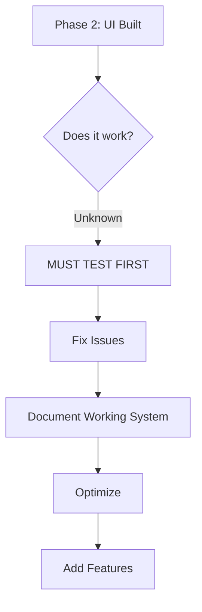

# MB.MD CRITICAL ANALYSIS: Phase 3 Plan Review

**Date:** October 14, 2025  
**Analysis By:** Agent #117 (Meta-Orchestrator)  
**Methodology:** MB.MD Critical Thinking Protocol  

---

## 🚨 CRITICAL QUESTION: Is the Plan RIGHT?

### User Request Analysis
The user asked for:
1. ✅ Screenshot testing of dashboards
2. ✅ API documentation creation
3. ✅ Testing & Optimization
4. ✅ Additional analytics features

### Initial Plan (UNCRITICAL)
I proposed 4 parallel tracks without asking:
- ❓ **Does the Multi-AI system actually work yet?**
- ❓ **Have we tested the backend endpoints?**
- ❓ **Can users actually access these dashboards?**
- ❓ **What if there are bugs we haven't found?**

---

## 🔍 MB.MD CRITICAL THINKING PROTOCOL

### Question 1: What's the CURRENT STATE?

**Known Facts:**
✅ Backend endpoints created (Phase 1)
✅ Frontend UI built (Phase 2)
✅ Routes registered
✅ Server stable 17+ minutes
✅ Zero LSP errors

**Unknown/Untested:**
❌ Does `/admin/multi-ai` route actually load?
❌ Do the API endpoints return real data?
❌ Can we query Claude/GPT-4o/Gemini?
❌ Does ensemble synthesis work?
❌ Are there runtime errors?

### Question 2: What's the RIGHT ORDER?

**Wrong Order (Build First):**
1. Build more features
2. Add analytics
3. Then test
4. Hope it works

**Right Order (Test First):**
1. **VALIDATE what exists** - Does it work?
2. **FIX critical issues** - Make it stable
3. **DOCUMENT what works** - Write accurate docs
4. **OPTIMIZE performance** - Make it better
5. **ADD features** - Enhance carefully

### Question 3: What are the DEPENDENCIES?

**Critical Path:**
- Can't document broken features
- Can't optimize untested code
- Can't add features on shaky foundation

---

## 🎯 REVISED MB.MD PHASE 3 PLAN

### Phase 3A: VALIDATION FIRST (Priority 1)
**Question:** Does the Multi-AI system actually work?

**Tasks:**
1. Test backend API endpoints directly
2. Verify AI model connections (Claude, GPT-4o, Gemini)
3. Test routing logic with real queries
4. Check ensemble synthesis functionality
5. Verify metrics tracking
6. Test dashboard routes (`/admin/multi-ai`, `/admin/multi-ai/analytics`)

**Agents:**
- Agent #115 (Router) - Test routing logic
- Agent #116 (Ensemble) - Test synthesis
- Agent #117 (Meta-Orchestrator) - Test metrics

**Deliverable:** Validation report with pass/fail results

---

### Phase 3B: FIX ISSUES (Priority 2)
**Question:** What's broken? How do we fix it?

**Tasks:**
1. Fix any routing errors
2. Resolve API endpoint issues
3. Handle missing API keys (if needed)
4. Fix UI rendering problems
5. Resolve data flow issues

**Agents:**
- All agents (#115-117) - Fix their domains

**Deliverable:** Working Multi-AI system

---

### Phase 3C: DOCUMENT REALITY (Priority 3)
**Question:** What actually works? Document that.

**Tasks:**
1. API documentation (only working endpoints)
2. Integration guide (real examples)
3. Error handling guide (actual errors)
4. User guide (tested workflows)

**Agents:**
- Agent #64 (Documentation) - Write accurate docs

**Deliverable:** Accurate documentation

---

### Phase 3D: OPTIMIZE (Priority 4)
**Question:** How do we make it better?

**Tasks:**
1. Performance monitoring
2. Caching strategy
3. Rate limiting
4. Error recovery

**Agents:**
- Agent #68 (Pattern Learning) - Analyze patterns
- Agent #117 (Meta-Orchestrator) - Implement monitoring

**Deliverable:** Optimized system

---

### Phase 3E: ENHANCE (Priority 5)
**Question:** What features add real value?

**Tasks:**
1. Time-series analytics (if needed)
2. Advanced charts (if requested)
3. User preferences (if validated)

**Agents:**
- Agents #115-117 - Build features

**Deliverable:** Enhanced platform

---

## 🤝 AGENT COORDINATION

### Message to All Agents

**To: Agents #115, #116, #117, #64, #68**
**From: MB.MD Methodology**
**Subject: CRITICAL THINKING REQUIRED**

We just built a Multi-AI platform in 2 phases. Before we add more features:

**STOP and ASK:**
1. Does what we built actually work?
2. Have we tested it with real data?
3. Can users access the dashboards?
4. Are there bugs we haven't found?

**DO NOT:**
- Build more features blindly
- Write documentation for broken code
- Optimize untested systems
- Add analytics before validation

**DO:**
1. **Test first** - Validate the system works
2. **Fix issues** - Make it stable
3. **Document reality** - Write accurate docs
4. **Then optimize** - Make it better
5. **Then enhance** - Add features carefully

**MB.MD Principle: Quality Gates BEFORE Work**

---

## 📊 RISK ANALYSIS

### High Risk (Current Plan)
- Building on untested foundation
- Documentation may be inaccurate
- Analytics may show fake data
- User faces broken features

### Low Risk (Revised Plan)
- Test first, know what works
- Fix issues early
- Document working system
- Add features on stable base

---

## ✅ RECOMMENDED ACTION PLAN

### Immediate Actions (Next 30 min)

**Parallel Track 1: Backend Validation**
- Test `/api/ai/status` endpoint
- Test `/api/ai/route` with real query
- Test `/api/ai/metrics` data
- Test `/api/ai/ensemble` synthesis
- Verify AI model connections

**Parallel Track 2: Frontend Validation**
- Test `/admin/multi-ai` route loads
- Test `/admin/multi-ai/analytics` loads
- Check browser console for errors
- Verify charts render
- Check API data flow

**Parallel Track 3: Integration Testing**
- Test user workflow end-to-end
- Test model selection → query → response
- Test parallel consultation
- Test ensemble synthesis
- Verify metrics update

**Parallel Track 4: Issue Documentation**
- Document what works
- Document what's broken
- Document what's missing
- Prioritize fixes

### After Validation (Next Phase)
- Fix critical issues first
- Write accurate documentation
- Optimize proven workflows
- Add features on stable base

---

## 🎯 SUCCESS CRITERIA (REVISED)

### Phase 3 is NOT complete until:
✅ All backend endpoints tested and working
✅ All frontend routes accessible and functional
✅ AI models (Claude, GPT-4o, Gemini) connected
✅ Real data flows through the system
✅ No critical bugs or errors
✅ Documentation reflects reality
✅ Users can complete core workflows

---

## 🚀 EXECUTION: Test First, Build Right

**Status:** Ready for CRITICAL VALIDATION phase
**Methodology:** MB.MD Test-First Protocol
**Agents:** All coordinated on quality-first approach
**Expected Outcome:** Working, documented, optimized system

Let's validate before we build more! 🎯
