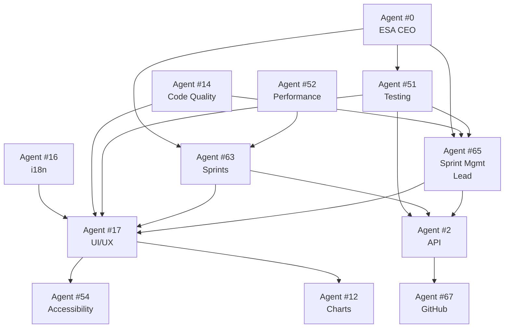

# Project Tracker - Agent Responsibility Matrix
## Who Builds What

**Last Updated:** October 11, 2025  
**Total Agents:** 8 primary + 4 supporting = 12 agents  
**Total Effort:** 45-55 hours

---

## 📊 Agent Assignment Table

| Page/Component | Lead Agent | Supporting Agents | Deliverables | Estimated Hours |
|---------------|------------|-------------------|--------------|-----------------|
| **Dashboard Page** | #65 (Sprint Mgmt) | #17 (UI), #12 (Charts), #2 (API) | 4 widgets, metrics API, real-time updates | 6h |
| **Epics List** | #65 (Sprint Mgmt) | #17 (Tables), #52 (Search), #2 (API) | Sortable table, filters, bulk actions, pagination | 4h |
| **Epic Detail** | #65 (Sprint Mgmt) | #17 (Layout), #14 (Code Quality), #2 (API) | Story list, progress chart, activity log, breadcrumbs | 5h |
| **Stories List** | #65 (Sprint Mgmt) | #17 (Tables), #51 (Testing UI), #2 (API) | Task breakdown view, agent filter, status workflow | 4h |
| **Story Detail** | #65 (Sprint Mgmt) | #17 (Forms), #54 (A11y), #2 (API) | Task cards, comments thread, code links UI, agent assignments | 6h |
| **Sprint Board** | #63 (Sprints) | #17 (Kanban), #52 (Perf), #2 (API) | Kanban columns, drag-drop, burndown chart, velocity | 8h |
| **Kanban View** | #63 (Sprints) | #17 (DnD), #65 (Logic), #2 (API) | Multi-sprint board, swimlanes, WIP limits | 6h |
| **Agent Selector** | #17 (UI/UX) | #65 (Agent Data), #2 (API) | Hierarchical dropdown, 105-agent list, search, icons | 3h |
| **CodeLinkInput** | #17 (UI/UX) | #14 (Validation), #67 (GitHub) | File path input, line range, validation, VSCode links | 2h |
| **AgentWorkloadChart** | #12 (Data Viz) | #65 (Calc Logic), #2 (API) | Bar chart, capacity bars, utilization %, tooltips | 3h |
| **SprintBurndown** | #12 (Data Viz) | #63 (Sprint Logic), #2 (API) | Line chart, ideal line, velocity indicator, zoom | 3h |
| **GitHub Sync** | #67 (GitHub) | #65 (Tracker), #2 (Webhooks) | Issue import, bidirectional sync, conflict resolution | 5h |

---

## 🤖 Agent Details

### Primary Agents (8)

#### Agent #65: Sprint & Resource Management (Lead)
**Role:** Overall feature owner, business logic  
**Responsibilities:**
- Feature architecture
- Sprint planning algorithms
- Agent workload calculation
- Story/task status workflows
- Epic/story/task CRUD coordination

**Deliverables:**
- Dashboard page (6h)
- Epics list (4h)
- Epic detail (5h)
- Stories list (4h)
- Story detail (6h)

**Total Effort:** 25 hours

---

#### Agent #17: UI/UX Design (Aurora Tide Expert)
**Role:** All visual components, Aurora Tide compliance  
**Responsibilities:**
- Page layouts
- Component design
- Animations (FadeIn, ScaleIn)
- Dark mode implementation
- Responsive design

**Deliverables:**
- Dashboard widgets UI (2h)
- Table components (3h)
- Form layouts (2h)
- Agent selector (3h)
- Code link input (2h)
- Kanban board UI (4h)

**Total Effort:** 16 hours

---

#### Agent #2: API Structure
**Role:** All backend endpoints  
**Responsibilities:**
- RESTful API design
- Request/response schemas
- Error handling
- Data validation (Zod)

**Deliverables:**
- Dashboard metrics endpoint (1h)
- Agent workload endpoint (2h)
- Code linking endpoints (1h)
- Activity log endpoint (1h)
- Bulk action endpoints (2h)

**Total Effort:** 7 hours

---

#### Agent #63: Sprint Management
**Role:** Sprint-specific features  
**Responsibilities:**
- Sprint board logic
- Kanban drag-drop
- Burndown calculations
- Velocity tracking

**Deliverables:**
- Sprint board (8h)
- Kanban view (6h)
- Sprint planning UI (3h)

**Total Effort:** 17 hours

---

#### Agent #67: GitHub Expertise
**Role:** GitHub integration  
**Responsibilities:**
- Issue sync (bidirectional)
- Webhook handling
- Pull request tracking
- Branch management

**Deliverables:**
- GitHub sync service (5h)
- Webhook endpoints (2h)
- Conflict resolution (2h)

**Total Effort:** 9 hours

---

#### Agent #12: Data Visualization Expert
**Role:** All charts and graphs  
**Responsibilities:**
- Chart design (Recharts)
- Data transformations
- Responsive charts
- Accessibility (chart alt text)

**Deliverables:**
- Workload bar chart (3h)
- Burndown line chart (3h)
- Epic pie chart (1h)
- Velocity chart (2h)

**Total Effort:** 9 hours

---

#### Agent #51: Testing Lead
**Role:** E2E and integration tests  
**Responsibilities:**
- Playwright test suite
- Test scenarios
- Coverage reports
- CI/CD integration

**Deliverables:**
- Dashboard E2E tests (2h)
- Epic/Story E2E tests (3h)
- Sprint board E2E tests (3h)
- Integration tests (2h)

**Total Effort:** 10 hours

---

#### Agent #54: Accessibility Expert
**Role:** WCAG 2.1 AA compliance  
**Responsibilities:**
- ARIA labels
- Keyboard navigation
- Screen reader support
- Color contrast

**Deliverables:**
- Accessibility audit (2h)
- ARIA implementation (3h)
- Keyboard nav (2h)
- Documentation (1h)

**Total Effort:** 8 hours

---

### Supporting Agents (4)

#### Agent #52: Performance Lead
**Role:** Performance optimization  
**Effort:** 3 hours
- Kanban board performance
- Large list virtualization
- Bundle size optimization

#### Agent #14: Code Quality Expert
**Role:** Code review, linting  
**Effort:** 2 hours
- ESLint configuration
- TypeScript strict mode
- Code review

#### Agent #16: i18n Expert
**Role:** Internationalization  
**Effort:** 4 hours
- Translation key extraction
- 68-language translation
- i18n testing

#### Agent #0: ESA Orchestrator (CEO)
**Role:** Final approval  
**Effort:** 2 hours
- Architecture review
- Quality gate validation
- Sign-off

---

## 🔄 Agent Dependencies

**Dependency Flow:**
1. Agent #2 (API) builds endpoints FIRST
2. Agent #17 (UI) builds components using APIs
3. Agent #65 (Sprint Mgmt) coordinates integration
4. Agent #63 (Sprints) builds on top of #65
5. Agent #51 (Testing) validates all work
6. Agent #0 (ESA CEO) gives final approval

---

## 📅 Implementation Timeline

### Week 1: Foundation (Agents #2, #17, #65)
**Days 1-2:** Database & API (Agent #2)
- [x] Schema complete
- [x] API routes complete

**Days 3-5:** Core UI (Agent #17, #65)
- [x] Dashboard page
- [x] Epics list
- [x] Epic detail

### Week 2: Agent Features (Agents #65, #17)
**Days 1-2:** Agent Assignment
- [ ] Agent selector component (Agent #17)
- [ ] Agent assignment API (Agent #2)
- [ ] Agent workload chart (Agent #12)

**Days 3-5:** Code Linking
- [ ] Code link input (Agent #17)
- [ ] Code link API (Agent #2)
- [ ] VSCode protocol links (Agent #67)

### Week 3: Sprint Features (Agent #63, #12)
**Days 1-3:** Sprint Board
- [ ] Kanban board (Agent #63, #17)
- [ ] Drag-drop (Agent #63)
- [ ] Burndown chart (Agent #12)

**Days 4-5:** Sprint Planning
- [ ] Sprint planning UI (Agent #63)
- [ ] Velocity tracking (Agent #63)

### Week 4: Integration & Testing (Agents #51, #67)
**Days 1-2:** GitHub Sync (Agent #67)
- [ ] Issue import
- [ ] Webhook setup
- [ ] Bidirectional sync

**Days 3-5:** Testing & Polish (Agent #51, #54)
- [ ] E2E test suite (Agent #51)
- [ ] Accessibility audit (Agent #54)
- [ ] Performance optimization (Agent #52)
- [ ] Final review (Agent #0)

---

## ✅ Review & Approval Flow

### Level 1: Peer Review
**Agent → Peer Agent**
- Agent #17 (UI) → Agent #54 (Accessibility) reviews
- Agent #2 (API) → Agent #14 (Code Quality) reviews
- Agent #63 (Sprints) → Agent #65 (Sprint Mgmt) reviews

### Level 2: Domain Review
**Domain Coordinator → Work**
- Domain #2 (Frontend) reviews all UI
- Domain #1 (Infrastructure) reviews all APIs
- Domain #5 (Business Logic) reviews workflows

### Level 3: Division Review
**Division Chief → Domain**
- Chief #2 (Core) reviews performance
- Chief #5 (Platform) reviews integration

### Level 4: Final Approval
**Agent #0 (ESA CEO) → Everything**
- Architecture compliance
- Quality gate validation
- 40x20s checkpoint verification
- Production deployment sign-off

---

## 📊 Effort Summary

| Agent | Role | Total Hours |
|-------|------|-------------|
| #65 | Sprint Mgmt (Lead) | 25h |
| #17 | UI/UX Design | 16h |
| #63 | Sprint Features | 17h |
| #51 | Testing | 10h |
| #12 | Data Viz | 9h |
| #67 | GitHub | 9h |
| #54 | Accessibility | 8h |
| #2 | API | 7h |
| #52 | Performance | 3h |
| #16 | i18n | 4h |
| #14 | Code Quality | 2h |
| #0 | ESA CEO | 2h |
| **Total** | **12 agents** | **112h** |

**Parallel Execution:** With 8 agents working simultaneously, total calendar time: **2-3 weeks**

---

## 🎯 Success Criteria

Feature is complete when ALL agents have:
- [ ] Completed assigned deliverables
- [ ] Passed peer review
- [ ] Passed domain review
- [ ] Passed division review
- [ ] Received Agent #0 (ESA CEO) approval
- [ ] All tests passing (E2E + unit)
- [ ] All performance targets met
- [ ] All accessibility requirements met
- [ ] All documentation complete

---

**Status:** Matrix complete, ready for parallel implementation  
**Next:** Each agent begins assigned work simultaneously
