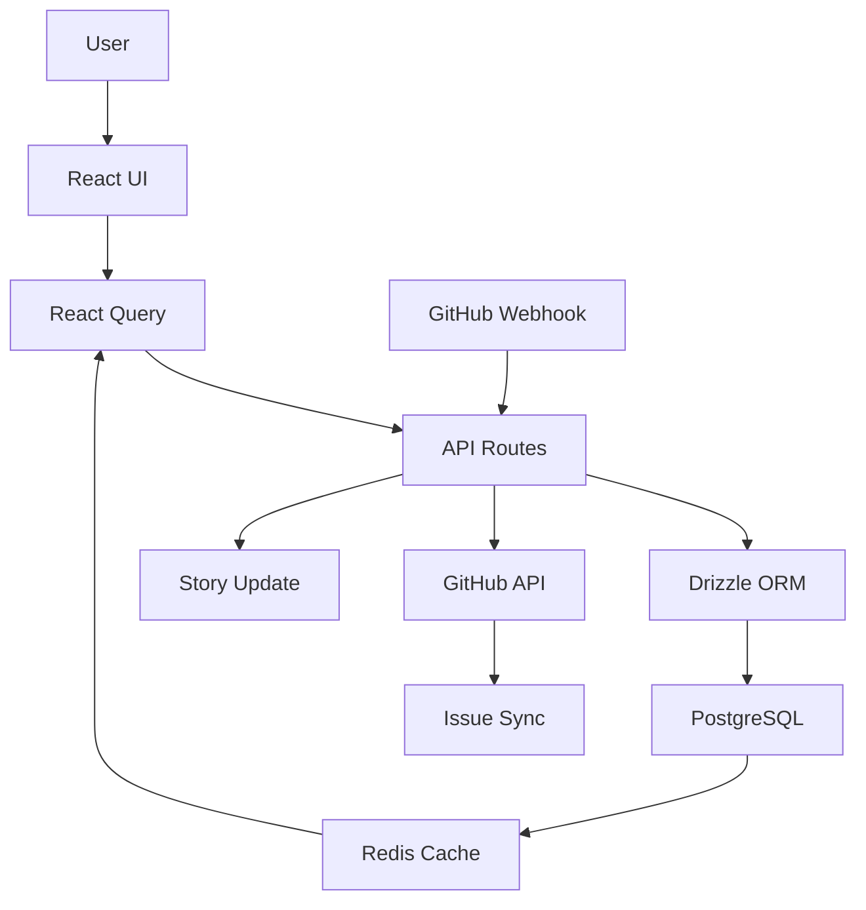

# Project Tracker - Master Architecture
## Self-Hosted Project Management System (Agent #65)

**ESA Layers:** 57 (Automation), 60 (GitHub)  
**Lead Agent:** Agent #65 (Sprint & Resource Management)  
**Version:** 1.0  
**Date:** October 11, 2025

---

## 🎯 Executive Summary

Self-hosted project management system replacing Jira. Manages Epics, Stories, Tasks, and Sprints with agent assignment tracking, code linking, and GitHub bidirectional sync. Built on ESA 105-Agent System with 61-Layer Framework framework with Aurora Tide design system.

**Core Value:** Track 81 re-audit tasks from Epic MUN-109 with agent assignments, code file links, and effort tracking - all in one system.

---

## 🤖 Agent Assignments

### Lead Agent
- **Agent #65:** Sprint & Resource Management
  - Overall system architecture
  - Business logic coordination
  - Sprint planning algorithms
  - Agent workload balancing

### Supporting Agents
- **Agent #17:** UI/UX Design (Aurora Tide)
  - All page layouts
  - Component design
  - Animations & micro-interactions
  
- **Agent #2:** API Structure
  - All backend endpoints
  - Data validation
  - Error handling
  
- **Agent #63:** Sprint Management
  - Sprint board
  - Burndown charts
  - Velocity tracking
  
- **Agent #67:** GitHub Expertise
  - Issue sync
  - Webhook integration
  - Branch tracking
  
- **Agent #12:** Data Visualization
  - Charts (burndown, workload, velocity)
  - Dashboards
  - Metrics visualization
  
- **Agent #51:** Testing Lead
  - E2E test suite
  - Integration tests
  - Test automation
  
- **Agent #54:** Accessibility
  - WCAG 2.1 AA compliance
  - Keyboard navigation
  - Screen reader support

---

## 📄 Pages/Views (7 Total)

1. **Dashboard Overview** - Metrics, widgets, quick actions
2. **Epics List** - Table view with filtering
3. **Epic Detail** - Story breakdown, progress tracking
4. **Stories List** - Task management view
5. **Story Detail** - Task cards, comments, code links
6. **Sprint Board** - Active sprint kanban
7. **Kanban View** - Multi-sprint board

---

## 🏗️ ESA Layer Mapping

### Layer 57: Automation Management (Primary)
- **Components:**
  - Sprint automation (auto-start, auto-complete)
  - Task status workflows
  - Notification triggers
  - GitHub webhook automation

### Layer 60: GitHub Expertise (Secondary)
- **Components:**
  - Issue bidirectional sync
  - Pull request tracking
  - Branch management
  - Commit linking

### Supporting Layers
- **Layer 1 (Database):** 6 tables (epics, stories, tasks, sprints, milestones, comments)
- **Layer 2 (API):** 20+ REST endpoints
- **Layer 8 (Frontend):** React + TypeScript
- **Layer 10 (Components):** Aurora Tide GlassCards
- **Layer 14 (Caching):** Redis for dashboard metrics
- **Layer 18 (Analytics):** Velocity, burndown, workload charts

---

## 🛠️ Tech Stack

### Frontend
- **Framework:** React 18 + TypeScript
- **UI Library:** Aurora Tide Design System
- **Components:** shadcn/ui (GlassCard, Form, Dialog, Tabs)
- **Forms:** react-hook-form + zod validation
- **Data:** @tanstack/react-query v5
- **Drag & Drop:** @dnd-kit/core
- **Charts:** Recharts
- **Animations:** Framer Motion + GSAP

### Backend
- **Server:** Express.js + TypeScript
- **ORM:** Drizzle ORM
- **Validation:** Zod schemas
- **Auth:** JWT + session
- **Webhooks:** GitHub webhooks for issue sync

### Database
- **System:** PostgreSQL (Neon)
- **Tables:** 6 core tables
  - `projectEpics`
  - `projectStories`
  - `projectTasks`
  - `projectSprints`
  - `projectMilestones`
  - `projectComments`

### Integrations
- **GitHub:** Issue sync, PR tracking
- **Agent System:** 105-agent assignment tracking
- **Code Editor:** VSCode protocol links

---

## 📊 Success Metrics (40x20s Quality Gates)

### Performance
- ✅ Dashboard load: < 500ms
- ✅ Epic creation: < 2 seconds
- ✅ Story creation: < 1 second
- ✅ API response: < 200ms average
- ✅ Real-time updates: < 100ms latency

### Accuracy
- ✅ Story points tracking: 100% accurate
- ✅ Agent workload calculation: Real-time
- ✅ Burndown charts: Auto-updating
- ✅ GitHub sync: Bidirectional, no conflicts

### Usability
- ✅ Agent assignment: 3 clicks maximum
- ✅ Code linking: 2 clicks maximum
- ✅ Sprint planning: Drag-drop enabled
- ✅ Mobile responsive: 100% functional

### Accessibility
- ✅ WCAG 2.1 AA: Full compliance
- ✅ Keyboard navigation: Complete
- ✅ Screen reader: Fully supported
- ✅ Color contrast: 4.5:1 minimum

### Testing
- ✅ E2E coverage: 80%+
- ✅ Unit test coverage: 90%+
- ✅ Integration tests: All critical paths
- ✅ Performance tests: Lighthouse > 90

---

## 🔄 Data Flow



---

## 📋 Feature Breakdown

### Core Features (MVP)
- ✅ Epic/Story/Task CRUD
- ✅ Sprint management
- ✅ Agent assignment
- ✅ Code file linking
- ✅ Comments & collaboration
- ✅ Dashboard metrics

### Enhanced Features (Phase 2)
- 🔄 Kanban drag-drop (in progress)
- 🔄 Agent workload charts (in progress)
- 🔄 Sprint burndown (in progress)
- ⏳ GitHub issue sync (pending)
- ⏳ Timeline/Gantt view (pending)
- ⏳ CSV/PDF export (pending)

### Advanced Features (Future)
- ⏳ AI-powered sprint planning
- ⏳ Predictive velocity
- ⏳ Automated task assignment
- ⏳ Smart code link detection

---

## 🗂️ Documentation Structure

```
docs/features/project-tracker/
├── master-architecture.md (this file)
├── agent-matrix.md
├── api-contracts.md
├── database-schema.md
├── component-inventory.md
├── testing-plan.md
└── pages/
    ├── dashboard-architecture.md
    ├── epics-list-architecture.md
    ├── epic-detail-architecture.md
    ├── stories-list-architecture.md
    ├── story-detail-architecture.md
    ├── sprint-board-architecture.md
    └── kanban-view-architecture.md
```

---

## 🚀 Implementation Phases

### Phase 1: Foundation (COMPLETE ✅)
- Database schema created
- API routes implemented
- Basic UI with forms
- Epic/Story/Task CRUD functional

### Phase 2: Agent Integration (IN PROGRESS)
- Agent selector component
- Code link input component
- Agent workload tracking
- Story-agent assignment UI

### Phase 3: Sprint Features (NEXT)
- Kanban board with drag-drop
- Sprint planning interface
- Burndown charts
- Velocity tracking

### Phase 4: Advanced (FUTURE)
- GitHub bidirectional sync
- Timeline/Gantt views
- Reporting & exports
- AI-powered features

---

## 📈 Current Status

**Overall Progress:** 60% complete

| Component | Status | Agent | Progress |
|-----------|--------|-------|----------|
| Database Schema | ✅ Complete | #2 | 100% |
| API Routes | ✅ Complete | #2 | 100% |
| Basic UI | ✅ Complete | #17 | 100% |
| Agent Assignment | 🔄 In Progress | #65 | 40% |
| Code Linking | 🔄 In Progress | #65 | 30% |
| Kanban Board | ⏳ Pending | #63 | 0% |
| Sprint Planning | ⏳ Pending | #63 | 0% |
| Charts | ⏳ Pending | #12 | 0% |
| GitHub Sync | ⏳ Pending | #67 | 0% |

---

## 🔗 Related Documentation

- **ESA Framework:** `docs/platform-handoff/ESA_FRAMEWORK.md`
- **Agent Org Chart:** `docs/platform-handoff/ESA_AGENT_ORG_CHART.md`
- **Aurora Tide:** `docs/platform-handoff/AURORA_TIDE_DESIGN_SYSTEM.md`
- **Re-Audit Tasks:** `docs/build-coordination/reaudit-task-extraction-with-agents.md`

---

**Next Steps:** Complete all 7 page architecture docs, then implement agent assignment and code linking features in parallel.
