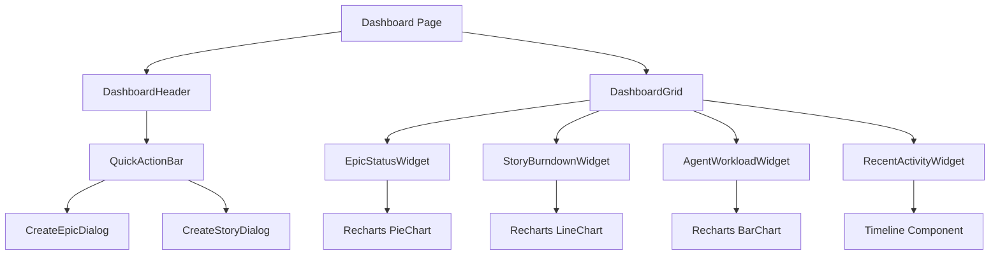

# Project Tracker - Dashboard Page Architecture
## Overview & Metrics View

**Agent Lead:** Agent #65 (Sprint & Resource Management)  
**Supporting:** Agent #17 (UI), Agent #12 (Charts), Agent #2 (API)  
**File:** `client/src/pages/admin/projects.tsx` (Tab: Dashboard)

---

## 🎯 Page Purpose

Central command center showing:
- Epic status overview (pie chart)
- Story progress (burndown)
- Agent workload distribution
- Recent activity timeline
- Quick action buttons

---

## 👥 Customer Journey

### Primary Flow: Project Manager Reviews Progress

1. **User clicks** "Project Tracker" in admin sidebar
   - System loads dashboard tab (default view)
   
2. **User sees** 4 metric widgets:
   - **Epic Status Widget:** Pie chart (To Do: 2, In Progress: 3, Done: 2)
   - **Story Burndown:** Line chart showing velocity
   - **Agent Workload:** Bar chart (Agent #52: 18h, Agent #51: 16h, etc.)
   - **Recent Activity:** Timeline of last 10 actions
   
3. **User clicks** "Create Epic" button
   - Modal opens with epic creation form
   - User fills: Key, Summary, Description, Priority
   - System creates epic, refreshes dashboard
   
4. **User clicks** epic card from activity feed
   - Navigates to Epic Detail page
   - Sees story breakdown

### Secondary Flow: Quick Navigation

1. User sees epic summary cards
2. Clicks epic → Goes to detail
3. Clicks story count badge → Goes to stories list
4. Clicks agent avatar → Filters by agent

---

## 🎨 UI Components

### Layout Structure
```tsx
<DashboardLayout>
  <DashboardHeader>
    <h1>Self-Hosted Project Tracker</h1>
    <QuickActionBar>
      <Button>Create Epic</Button>
      <Button>Create Story</Button>
    </QuickActionBar>
  </DashboardHeader>
  
  <DashboardGrid cols={4}>
    <EpicStatusWidget />
    <StoryBurndownWidget />
    <AgentWorkloadWidget />
    <RecentActivityWidget />
  </DashboardGrid>
</DashboardLayout>
```

### Component Details

#### 1. `<DashboardHeader>`
**Props:**
```typescript
{
  title: string;
  actions: ReactNode;
}
```
**State:** None (stateless)  
**Aurora Tide:** GlassCard depth={1} with gradient text

#### 2. `<QuickActionBar>`
**Props:**
```typescript
{
  onCreateEpic: () => void;
  onCreateStory: () => void;
}
```
**State:** Dialog open states  
**Aurora Tide:** Gradient buttons with hover effects

#### 3. `<EpicStatusWidget>`
**Props:**
```typescript
{
  stats: { status: string; count: number }[];
}
```
**Renders:**
- GlassCard container
- Pie chart (Recharts)
- Legend with counts
- Click handler → Filter epics

**Data Source:** `GET /api/tracker/dashboard`

#### 4. `<StoryBurndownWidget>`
**Props:**
```typescript
{
  stats: { status: string; count: number; totalPoints: number }[];
}
```
**Renders:**
- GlassCard container
- Line chart (Recharts)
- Story points axis
- Status breakdown

#### 5. `<AgentWorkloadWidget>`
**Props:**
```typescript
{
  agents: { agentId: string; assigned: number; capacity: number }[];
}
```
**Renders:**
- GlassCard container
- Horizontal bar chart
- Agent names with avatars
- Workload percentage
- Click handler → Filter by agent

**Data Source:** `GET /api/tracker/agent-workload`

#### 6. `<RecentActivityWidget>`
**Props:**
```typescript
{
  activities: ActivityLog[];
}
```
**Renders:**
- GlassCard container
- Vertical timeline
- Activity items with icons
- Relative timestamps
- Click handler → Navigate to item

---

## 📊 Data Model

### DashboardStats (Main)
```typescript
type DashboardStats = {
  epics: {
    status: 'to_do' | 'in_progress' | 'done' | 'cancelled';
    count: number;
  }[];
  
  stories: {
    status: string;
    count: number;
    totalPoints: number;
  }[];
  
  agentWorkload: {
    agentId: string;
    agentName: string;
    assigned: number; // hours
    capacity: number; // hours
    utilization: number; // percentage
  }[];
  
  activeSprint: {
    id: number;
    name: string;
    progress: number;
  } | null;
  
  timestamp: Date;
};
```

### ActivityLog
```typescript
type ActivityLog = {
  id: number;
  type: 'epic_created' | 'story_updated' | 'task_completed' | 'sprint_started';
  epicId?: number;
  storyId?: number;
  userId: number;
  userName: string;
  description: string;
  timestamp: Date;
};
```

---

## 🔌 API Endpoints

### GET `/api/tracker/dashboard`
**Purpose:** Fetch all dashboard metrics

**Response:**
```typescript
{
  success: true;
  data: {
    epics: [...],
    stories: [...],
    agentWorkload: [...],
    activeSprint: {...},
    timestamp: "2025-10-11T..."
  }
}
```

**Cache:** 30 seconds (React Query)  
**Refetch:** On window focus  
**Error:** Show toast, retry button

### GET `/api/tracker/activity`
**Purpose:** Fetch recent activity log

**Query Params:**
```typescript
{
  limit?: number; // default 10
  type?: string; // filter by type
}
```

**Response:**
```typescript
{
  success: true;
  data: ActivityLog[];
}
```

---

## 🔄 State Management

### React Query
```tsx
const { data: dashboard } = useQuery<{ data: DashboardStats }>({
  queryKey: ['/api/tracker/dashboard'],
  refetchInterval: 30000, // 30 seconds
  refetchOnWindowFocus: true
});

const { data: activity } = useQuery<{ data: ActivityLog[] }>({
  queryKey: ['/api/tracker/activity'],
  refetchInterval: 10000 // 10 seconds
});
```

### Local State
```tsx
const [activeTab, setActiveTab] = useState('dashboard');
const [createEpicOpen, setCreateEpicOpen] = useState(false);
const [createStoryOpen, setCreateStoryOpen] = useState(false);
```

---

## ✨ Aurora Tide Compliance

### Design System Checklist
- [x] **GlassCard:** All widgets use `<GlassCard depth={2}>`
- [x] **Dark Mode:** All charts adapt colors
  - Light: MT Ocean palette (turquoise, cyan, blue)
  - Dark: Muted ocean tones
- [x] **Animations:**
  - FadeIn on mount (widgets)
  - ScaleIn on hover (cards)
  - Stagger children (0.1s delay each)
- [x] **i18n:** All text translated
  - `t('tracker.dashboard.title')`
  - `t('tracker.dashboard.epic_status')`
  - `t('tracker.dashboard.recent_activity')`
- [x] **Accessibility:**
  - ARIA labels on charts
  - Keyboard navigation (Tab to widgets)
  - Screen reader: Chart summaries announced
- [x] **Data-testids:**
  - `data-testid="widget-epic-status"`
  - `data-testid="widget-burndown"`
  - `data-testid="widget-workload"`
  - `data-testid="widget-activity"`
  - `data-testid="button-create-epic"`

### Color Palette (MT Ocean Theme)
```css
/* Epic Status Colors */
--to-do: hsl(220, 13%, 69%); /* gray */
--in-progress: hsl(177, 72%, 56%); /* turquoise */
--done: hsl(158, 64%, 52%); /* green */
--cancelled: hsl(0, 65%, 61%); /* red */

/* Chart Colors */
--chart-1: hsl(177, 72%, 56%); /* turquoise */
--chart-2: hsl(195, 74%, 56%); /* cyan */
--chart-3: hsl(218, 100%, 66%); /* blue */
--chart-4: hsl(258, 86%, 64%); /* violet */
```

---

## 🧪 Testing Plan

### E2E Tests (Agent #51)
**File:** `tests/e2e/tracker/dashboard.spec.ts`

**Scenarios:**
1. **Load dashboard**
   ```typescript
   test('should load dashboard with all widgets', async ({ page }) => {
     await page.goto('/admin/projects');
     await expect(page.getByTestId('widget-epic-status')).toBeVisible();
     await expect(page.getByTestId('widget-burndown')).toBeVisible();
     await expect(page.getByTestId('widget-workload')).toBeVisible();
     await expect(page.getByTestId('widget-activity')).toBeVisible();
   });
   ```

2. **Create epic from dashboard**
   ```typescript
   test('should create epic', async ({ page }) => {
     await page.getByTestId('button-create-epic').click();
     await page.getByTestId('input-epic-key').fill('MUN-110');
     await page.getByTestId('input-epic-summary').fill('Test Epic');
     await page.getByTestId('button-submit-epic').click();
     await expect(page.getByText('Epic created successfully')).toBeVisible();
   });
   ```

3. **Navigate from activity to epic**
   ```typescript
   test('should navigate to epic from activity', async ({ page }) => {
     await page.getByTestId('activity-item-0').click();
     await expect(page).toHaveURL(/\/admin\/projects\/epic\/\d+/);
   });
   ```

### Unit Tests
**File:** `tests/unit/DashboardWidgets.test.tsx`

**Coverage:**
- Widget rendering with data
- Empty state handling
- Error state display
- Loading skeleton
- Click handlers

---

## 📈 Performance Targets

| Metric | Target | Current | Status |
|--------|--------|---------|--------|
| Initial Load | < 500ms | TBD | ⏳ |
| Widget Render | < 100ms | TBD | ⏳ |
| Chart Draw | < 200ms | TBD | ⏳ |
| API Response | < 200ms | TBD | ⏳ |
| Real-time Update | < 100ms | TBD | ⏳ |

---

## 🔗 Component Dependencies



---

## ✅ Completion Criteria

Dashboard page is complete when:
- [ ] All 4 widgets render correctly
- [ ] Epic/Story creation works from quick actions
- [ ] Charts display accurate data
- [ ] Real-time updates working (30s interval)
- [ ] Activity timeline navigates correctly
- [ ] All data-testids present
- [ ] E2E tests passing (100%)
- [ ] Aurora Tide compliance verified
- [ ] Accessibility audit passed (WCAG 2.1 AA)
- [ ] Performance targets met
- [ ] Mobile responsive (100%)

---

**Status:** Ready for parallel implementation  
**Next:** Build widgets simultaneously with agent workload API
