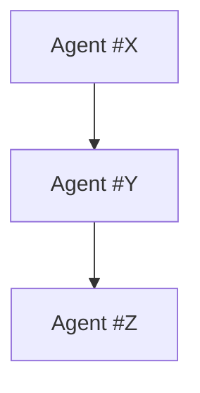

# ESA Feature Architecture Template
## The Complete Planning Framework for Every New Feature

**Version:** 1.0  
**Last Updated:** October 11, 2025  
**Purpose:** Enforce systematic architecture documentation for all features  
**Status:** Mandatory for all new development

---

## 🎯 Purpose

This template ensures **every new feature** has complete architecture documentation BEFORE building begins. No feature should be built without these documents.

---

## 📋 Required Documents Per Feature

For **EVERY** new feature, create these 5+ documents:

### 1. **`{feature}-master-architecture.md`** (Overview)

**Location:** `docs/features/{feature}/master-architecture.md`

**Must Include:**
- Executive Summary
- Agent Assignments (lead + supporting)
- All pages/views involved
- Tech stack decisions
- ESA layer mapping
- Success metrics (40x20s gates)

**Template:**
```markdown
# {Feature} - Master Architecture

## Executive Summary
[2-3 sentences: What this feature does, why it exists]

## Agent Assignments
- **Lead Agent:** Agent #{X} ({Role})
- **Supporting Agents:** Agent #{Y}, #{Z}

## Pages/Views
1. {Page 1} - {Purpose}
2. {Page 2} - {Purpose}
...

## ESA Layer Mapping
- Layer {X}: {Component}
- Layer {Y}: {Component}

## Tech Stack
- Frontend: {Technologies}
- Backend: {Technologies}
- Database: {Tables}

## Success Metrics
- Performance: {Target}
- Accuracy: {Target}
- UX: {Target}
```

---

### 2. **`{feature}-page-{name}-architecture.md`** (Per Page - ONE PER PAGE!)

**Location:** `docs/features/{feature}/pages/{page-name}-architecture.md`

**Must Include:**
- Agent assignments (who builds THIS page)
- Customer journey (for THIS page only)
- UI components (every element)
- Data model (what data THIS page uses)
- API endpoints (what THIS page calls)
- Aurora Tide compliance checklist

**Template:**
```markdown
# {Feature} - {Page Name} Page Architecture

## Agent Assignments
- **Lead:** Agent #{X} ({Role})
- **UI:** Agent #17 (UI/UX Design)
- **Backend:** Agent #2 (API Structure)

## Customer Journey
1. User {action}
2. System {response}
3. User sees {result}
...

## UI Components
- `<ComponentName>` - {Purpose}
  - Props: {list}
  - State: {list}
  - Events: {list}

## Data Model
```typescript
type PageData = {
  field1: type;
  field2: type;
}
```

## API Endpoints
- GET `/api/{endpoint}` - {Purpose}
- POST `/api/{endpoint}` - {Purpose}

## State Management
- React Query: `useQuery({ queryKey: [...] })`
- Local State: `useState(...)` for {...}

## Aurora Tide Compliance
- [ ] All containers use GlassCard
- [ ] Dark mode support complete
- [ ] Animations: FadeIn, ScaleIn
- [ ] i18n: All text translated
- [ ] Accessibility: WCAG 2.1 AA
- [ ] Data-testids: All interactive elements
```

---

### 3. **`{feature}-agent-matrix.md`** (Who Builds What)

**Location:** `docs/features/{feature}/agent-matrix.md`

**Must Include:**
- Agent assignment table
- Deliverables per agent
- Dependencies between agents
- Review/approval flow

**Template:**
```markdown
# {Feature} - Agent Responsibility Matrix

## Agent Assignments

| Page/Component | Lead Agent | Supporting Agents | Deliverables | Estimated Hours |
|---------------|------------|-------------------|--------------|-----------------|
| {Page 1} | #{X} ({Role}) | #{Y}, #{Z} | {List} | {Hours} |
| {Page 2} | #{X} ({Role}) | #{Y}, #{Z} | {List} | {Hours} |

## Agent Dependencies


## Review Flow
1. Agent #{X} completes → Agent #{Y} reviews
2. Agent #{Y} approves → Agent #{Z} integrates
3. Agent #{Z} validates → Agent #0 (ESA) final approval
```

---

### 4. **`{feature}-api-contracts.md`** (Complete API Spec)

**Location:** `docs/features/{feature}/api-contracts.md`

**Must Include:**
- Every endpoint
- Request/response schemas
- Error handling
- Authentication requirements
- Rate limits

**Template:**
```markdown
# {Feature} - API Contracts

## Endpoint: GET /api/{resource}

**Purpose:** {What this endpoint does}

**Authentication:** Required (JWT)

**Request:**
```typescript
// Query params
{
  param1?: string;
  param2?: number;
}
```

**Response:**
```typescript
{
  success: boolean;
  data: {
    // Schema
  };
  error?: string;
}
```

**Error Codes:**
- 400: {Reason}
- 401: {Reason}
- 404: {Reason}
- 500: {Reason}

**Rate Limit:** 100 requests/minute
```

---

### 5. **`{feature}-database-schema.md`** (Data Model)

**Location:** `docs/features/{feature}/database-schema.md`

**Must Include:**
- All new tables
- All modified tables
- Relationships (foreign keys)
- Indexes
- Migration strategy

**Template:**
```markdown
# {Feature} - Database Schema

## New Tables

### Table: `{table_name}`

**Purpose:** {What this table stores}

**Schema:**
```typescript
export const tableName = pgTable("{table_name}", {
  id: serial("id").primaryKey(),
  field1: varchar("field1", { length: 255 }).notNull(),
  field2: integer("field2"),
  createdAt: timestamp("created_at").defaultNow(),
});
```

**Indexes:**
- `idx_{table}_field1` on `field1`

**Relations:**
```typescript
export const tableRelations = relations(tableName, ({ one, many }) => ({
  relation1: one(otherTable, {...}),
}));
```

## Modified Tables

### Table: `{existing_table}`

**Changes:**
- Add column: `new_field` (type)
- Add index: `idx_new_field`

## Migration Strategy
1. Run `npm run db:push --force`
2. Verify schema in database
3. Test all queries
```

---

### 6. **`{feature}-component-inventory.md`** (UI Components)

**Location:** `docs/features/{feature}/component-inventory.md`

**Must Include:**
- Every UI component
- Props interface
- Usage examples
- Aurora Tide compliance

**Template:**
```markdown
# {Feature} - Component Inventory

## Component: `<ComponentName>`

**Purpose:** {What this component does}

**File:** `client/src/components/{path}/ComponentName.tsx`

**Props:**
```typescript
interface ComponentNameProps {
  prop1: type;
  prop2?: type;
  onEvent: (data: type) => void;
}
```

**Usage:**
```tsx
<ComponentName
  prop1={value}
  prop2={value}
  onEvent={handleEvent}
  data-testid="component-name"
/>
```

**Aurora Tide Compliance:**
- ✅ Uses GlassCard depth={2}
- ✅ Dark mode: className="... dark:..."
- ✅ Animation: FadeIn wrapper
- ✅ i18n: All text uses t('key')
- ✅ Accessibility: ARIA labels, keyboard nav
- ✅ Data-testid: All interactive elements

**State:**
- Uses: `useState`, `useQuery`
- Manages: {What state}

**Dependencies:**
- Imports: `@/components/ui/...`
- Uses: `react-query`, `react-hook-form`
```

---

### 7. **`{feature}-testing-plan.md`** (QA Strategy)

**Location:** `docs/features/{feature}/testing-plan.md`

**Must Include:**
- E2E test scenarios
- Unit test coverage
- Performance benchmarks
- Accessibility tests

**Template:**
```markdown
# {Feature} - Testing Plan

## E2E Test Scenarios

### Scenario 1: {Test Name}
**Agent:** Agent #51 (Testing Lead)

**Steps:**
1. User {action}
2. System {response}
3. Verify {result}

**Expected:**
- {Assertion 1}
- {Assertion 2}

**File:** `tests/e2e/{feature}/{scenario}.spec.ts`

## Unit Tests

### Component: `<ComponentName>`
**Coverage Target:** 90%

**Tests:**
- ✅ Renders with props
- ✅ Handles events
- ✅ Shows loading state
- ✅ Handles errors

**File:** `tests/unit/{component}.test.tsx`

## Performance Benchmarks

| Metric | Target | Current | Status |
|--------|--------|---------|--------|
| Page Load | < 500ms | - | Pending |
| API Response | < 200ms | - | Pending |
| Lighthouse | > 90 | - | Pending |

## Accessibility Tests

- [ ] WCAG 2.1 AA compliant
- [ ] Keyboard navigation
- [ ] Screen reader compatible
- [ ] Color contrast verified
```

---

## 🚀 Usage Workflow

### When Starting a New Feature:

**Step 1: Create Document Structure (5 min)**
```bash
mkdir -p docs/features/{feature}/pages
touch docs/features/{feature}/master-architecture.md
touch docs/features/{feature}/agent-matrix.md
touch docs/features/{feature}/api-contracts.md
touch docs/features/{feature}/database-schema.md
touch docs/features/{feature}/component-inventory.md
touch docs/features/{feature}/testing-plan.md

# Create one architecture doc per page
touch docs/features/{feature}/pages/dashboard-architecture.md
touch docs/features/{feature}/pages/list-architecture.md
# ... etc for all pages
```

**Step 2: Fill Out Master Architecture (15 min)**
- Define overall vision
- Assign lead agent
- List all pages
- Map ESA layers

**Step 3: Create Page Architecture Docs (1 hour)**
- ONE document per page
- Complete customer journey
- List all UI components
- Define data model
- Specify API endpoints

**Step 4: Complete Supporting Docs (30 min)**
- Agent matrix: Who builds what
- API contracts: All endpoints
- Database schema: Tables and relations
- Component inventory: All UI elements
- Testing plan: E2E + unit tests

**Step 5: Review with Agent #0 (ESA CEO)**
- Validate architecture completeness
- Check agent assignments
- Verify ESA layer compliance
- Approve or request changes

**Step 6: Begin Parallel Implementation**
- Agents build assigned components
- Reference architecture docs continuously
- Update docs as implementation evolves

---

## ✅ Quality Gates (40x20s Framework)

Before marking feature "complete", verify:

### Documentation Gates
- [ ] Master architecture exists
- [ ] All pages have individual architecture docs
- [ ] Agent matrix complete
- [ ] API contracts documented
- [ ] Database schema documented
- [ ] Component inventory complete
- [ ] Testing plan created

### Implementation Gates
- [ ] All components built per spec
- [ ] All APIs implemented per contract
- [ ] Database schema deployed
- [ ] All tests passing (E2E + unit)
- [ ] Performance benchmarks met
- [ ] Accessibility verified (WCAG 2.1 AA)

### Aurora Tide Gates
- [ ] All pages use GlassCard
- [ ] Dark mode complete
- [ ] Animations applied (FadeIn, ScaleIn)
- [ ] i18n coverage 100%
- [ ] Data-testids on all interactive elements

---

## 📊 Example: Project Tracker

See complete example in:
- `docs/features/project-tracker/master-architecture.md`
- `docs/features/project-tracker/pages/*.md` (7 files)
- `docs/features/project-tracker/agent-matrix.md`
- `docs/features/project-tracker/api-contracts.md`

This is the **gold standard** all features must follow.

---

## 🎯 Benefits

**For Developers:**
- Clear specifications before coding
- No ambiguity about requirements
- Agent assignments explicit

**For Project Managers:**
- Complete visibility into scope
- Accurate effort estimates
- Clear dependencies

**For QA:**
- Test scenarios pre-defined
- Acceptance criteria clear
- Performance targets set

**For Future Maintenance:**
- Complete documentation exists
- Agent ownership clear
- Architecture decisions preserved

---

## 📋 Checklist for New Features

Before writing ANY code:

1. [ ] Create feature folder: `docs/features/{feature}/`
2. [ ] Write master architecture
3. [ ] Write page architecture for EVERY page
4. [ ] Complete agent matrix
5. [ ] Document API contracts
6. [ ] Define database schema
7. [ ] List all components
8. [ ] Create testing plan
9. [ ] Get Agent #0 (ESA CEO) approval
10. [ ] Begin implementation

**NO FEATURE GETS BUILT WITHOUT THESE DOCUMENTS.**

---

**This is the missing piece from ESA.md - now every feature has complete architecture from day one.** 🎯
