# Collaborative Audit Workflow v2.0
## Enhanced Agent-to-Agent Validation Protocol

**Created:** October 13, 2025  
**Purpose:** Enable intelligent page agents to collaborate with auditors for comprehensive validation  
**Methodology:** MB.MD Parallel Build System

---

## 🎯 Core Principle

**Every page has an intelligent Page Agent (P*) who is the Subject Matter Expert.**  
Auditors work WITH the page agent to validate functionality, not just test features independently.

---

## 📋 The 8-Step Workflow

### **Step 1: Identify Page for Audit**
```
Auditors: "What page are we auditing?"
Answer: Determine route (e.g., "/", "/events", "/admin/projects")
```

### **Step 2: Check for Page Agent**
```
Auditors: "Is there a Page Agent for this route?"

Action:
1. Check docs/The Pages/thepages.md
2. Find corresponding P* agent (e.g., P10 for "/")
3. Verify agent file exists: docs/The Pages/agents/P[X]_[name].md
```

### **Step 3: Verify Registry Entry**
```
Auditors: "Is the page agent registered?"

Action:
1. Check client/src/config/esaAgentPageRegistry.ts
2. Verify route exists with correct ESA agents
3. If missing → Flag as critical bug

Expected:
'/': [6, 11, 13],  // P10: Home Feed - ESA agents involved
```

### **Step 4: Engage Page Agent**
```
Auditors → P[X] Agent: "What are you supposed to do?"

P[X] Response:
- Lists all responsibilities
- Describes architecture
- Explains features
- Details backend routes
- Shows ESA agents involved

Example (P10):
"I manage the Home Feed at '/'. I should:
1. Display posts in real-time via WebSocket
2. Allow post creation via PostCreator
3. Show UpcomingEventsSidebar
4. Handle filtering, search, tags
5. Invalidate cache on mutations"
```

### **Step 5: Collaborative Testing**
```
Auditors → P[X]: "Are you ACTUALLY doing all of that?"

P[X] → Auditors: "Let's test together!"

Testing Protocol:
1. P[X] provides test scenarios from their knowledge base
2. Auditors execute each scenario
3. P[X] monitors for expected behavior
4. Both document results (pass/fail)

Example Test:
┌─────────────────────────────────────┐
│ Scenario: Real-time Feed Updates    │
├─────────────────────────────────────┤
│ 1. Open page in two tabs            │
│ 2. Create post in Tab 1             │
│ 3. Observe Tab 2                    │
│ Expected: Post appears within 1sec  │
└─────────────────────────────────────┘

P[X]: "Opening DevTools WebSocket tab..."
Auditors: "Post created in Tab 1"
P[X]: "WebSocket event 'post-update' fired? [YES/NO]"
Auditors: "YES - event received"
P[X]: "Feed updated in Tab 2? [YES/NO]"
Auditors: "NO - feed didn't update"
P[X]: "Issue identified! Let's investigate..."
```

### **Step 5.5: Create Page Agent (If Missing)**
```
If no P[X] agent exists:

Auditors: "We need to create an intelligent agent for this page!"

Actions:
1. Analyze page architecture:
   - Components used
   - Backend routes
   - Features implemented
   - ESA agents involved

2. Create P[X] agent file:
   - Route and responsibilities
   - Complete architecture docs
   - Test scenarios
   - Known issues section
   - Collaborative protocol

3. Register in esaAgentPageRegistry.ts

4. Update docs/The Pages/thepages.md

5. NOW engage with new P[X] agent (continue to Step 4)
```

### **Step 6: Investigate, Solve, Build, Test (Loop)**
```
When issues found:

All Agents Collaborate:
├── P[X]: "Here's what SHOULD happen..."
├── Auditors: "Here's what IS happening..."
├── ESA Agents: "Here's the code causing it..."
└── All: "Here's the fix!"

Process:
1. Investigate: Root cause analysis
   - P[X] explains expected behavior
   - Auditors show actual behavior
   - ESA agents review code

2. Solve: Plan the fix
   - ESA agents propose solution
   - P[X] validates approach
   - Auditors confirm test strategy

3. Build: Implement fix
   - ESA agents write code
   - P[X] monitors for correctness
   - Auditors prepare test cases

4. Test: Validate fix
   - P[X] runs test scenarios
   - Auditors execute validation
   - All confirm fix works

5. Repeat: Until all tests pass
   - Document each iteration
   - Update P[X] knowledge base
   - Track in project cards
```

### **Step 7: Update Project Cards & Documentation**
```
When work complete:

Create/Update in The Plan (/admin/projects):
1. Story Card: "[P10] Fix Real-time Feed Updates"
   - Description: WebSocket events not triggering feed refresh
   - Fix: Added event listener in SmartPostFeed
   - Tested: ✅ All scenarios pass
   - Assigned: ESA6 (State Management)

2. Update P[X] Agent File:
   - Mark features as tested ✅
   - Document fixes applied
   - Update known issues
   - Add performance metrics

3. Update md.md Documentation:
   - Add to replit.md recent changes
   - Update thepages.md agent status
   - Document in lessons learned
```

### **Step 8: Human Visibility**
```
Human User Sees:
1. Project card created in The Plan UI
2. Updated documentation in md files
3. Agent status changed (🔲 → ✅)
4. Lessons learned documented

Result:
- Full transparency of audit work
- Traceable fixes and decisions
- Knowledge preserved for future
- Human can review audit anytime
```

---

## 🔄 Audit Cycle Flow

```mermaid
graph TD
    A[Identify Page] --> B{Page Agent Exists?}
    B -->|No| C[Create P* Agent]
    C --> D[Engage Agent]
    B -->|Yes| E{Registered?}
    E -->|No| F[Fix Registry]
    F --> D
    E -->|Yes| D[Engage Agent]
    
    D --> G[Ask: What should you do?]
    G --> H[Agent Lists Responsibilities]
    H --> I[Ask: Are you doing it?]
    I --> J[Collaborative Testing]
    
    J --> K{All Tests Pass?}
    K -->|No| L[Investigate Together]
    L --> M[Solve Together]
    M --> N[Build Fix]
    N --> O[Test Fix]
    O --> K
    
    K -->|Yes| P[Update Project Cards]
    P --> Q[Update Documentation]
    Q --> R[Human Sees Updates]
    R --> S[Audit Complete ✅]
```



---

## 📝 Audit Checklist Template

Use this checklist for every page audit:

```markdown
## Page Audit: [Route Name]
**Route:** /[route]
**Date:** [Date]
**Auditors:** [List]

### Pre-Audit Setup
- [ ] Page agent exists (P[X])
- [ ] Agent registered in esaAgentPageRegistry.ts
- [ ] Agent file complete with architecture
- [ ] ESA Mind Map shows context

### Agent Engagement
- [ ] Asked: "What should you do?"
- [ ] Agent provided responsibilities
- [ ] Asked: "Are you doing it?"
- [ ] Collaborative testing initiated

### Testing (Per Feature)
For each feature P[X] lists:
- [ ] Test scenario defined
- [ ] Expected behavior documented
- [ ] Actual behavior tested
- [ ] Result: PASS/FAIL
- [ ] If FAIL: Investigation started

### Resolution (If Issues Found)
- [ ] Root cause identified
- [ ] Solution proposed
- [ ] Fix implemented
- [ ] Re-tested and validated
- [ ] P[X] agent updated

### Documentation
- [ ] Project card created
- [ ] P[X] file updated
- [ ] thepages.md status updated
- [ ] Lessons learned documented
- [ ] Human visibility confirmed

### Completion
- [ ] All tests pass
- [ ] P[X] agent confirms
- [ ] Auditors sign off
- [ ] Status: ✅ COMPLETE
```

---

## 🎯 Success Criteria

An audit is complete when:

1. ✅ **Page Agent Exists** - P[X] file created with full knowledge
2. ✅ **Registry Valid** - Route in esaAgentPageRegistry.ts
3. ✅ **All Tests Pass** - P[X] confirms everything works
4. ✅ **Documentation Updated** - Project cards, md files, lessons learned
5. ✅ **Human Visible** - User can see audit results and fixes
6. ✅ **Collaborative Record** - Full history of agent interactions documented

---

## 💡 Key Principles

### 1. **Page Agents Are Experts**
- They KNOW what should happen
- They VALIDATE what does happen
- They GUIDE the fix process

### 2. **Collaboration Over Isolation**
- Auditors + Page Agents work together
- ESA Agents contribute specialized knowledge
- All agents learn from the process

### 3. **Documentation Is Mandatory**
- Every finding documented
- Every fix tracked
- Every lesson preserved

### 4. **Human Visibility Required**
- Project cards show progress
- MD files show history
- UI shows current status

### 5. **Test Until Perfect**
- Don't stop at "mostly works"
- Loop until 100% validated
- Update knowledge base with findings

---

## 🚀 Example: P10 Home Feed Audit

**Step 1-2:** Identified "/" route → Found P10 agent  
**Step 3:** Verified registry ❌ - Route missing, fixed immediately  
**Step 4:** Engaged P10 - "I manage home feed with WebSocket..."  
**Step 5:** Collaborative testing - All scenarios defined  
**Step 6:** Found WebSocket issue - Fixed together  
**Step 7:** Created project card "Fix ESA Mind Map Context"  
**Step 8:** Human sees card in The Plan ✅

**Result:** 100% validated, documented, visible to humans!

---

## 📚 Related Documentation

- **The Pages Registry:** `docs/The Pages/thepages.md`
- **ESA Framework:** `docs/platform-handoff/esa.md`
- **Agent Registry:** `client/src/config/esaAgentPageRegistry.ts`
- **MB.MD Methodology:** `docs/MrBlue/mb-phase1-COMPLETE.md`
- **Example Agent:** `docs/The Pages/agents/P10_home_feed.md`

---

**This workflow ensures NO audit misses critical issues. Page agents are the key to collaborative excellence! 🎯**
